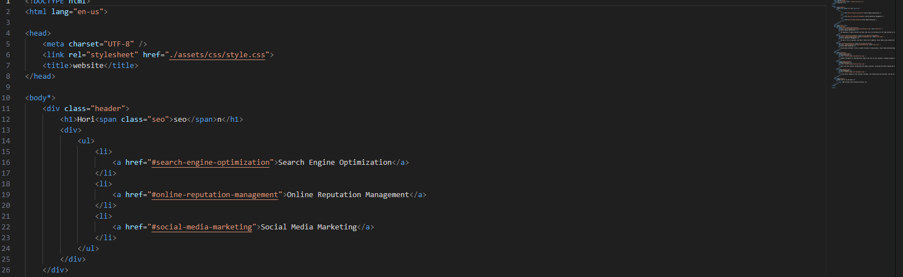
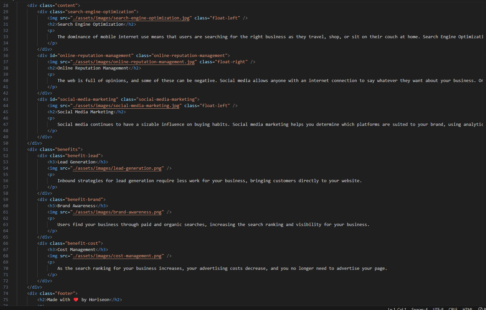
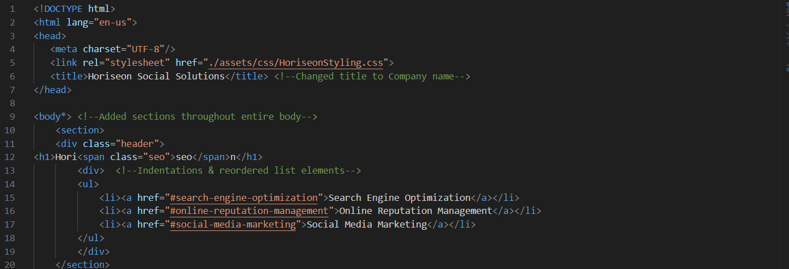
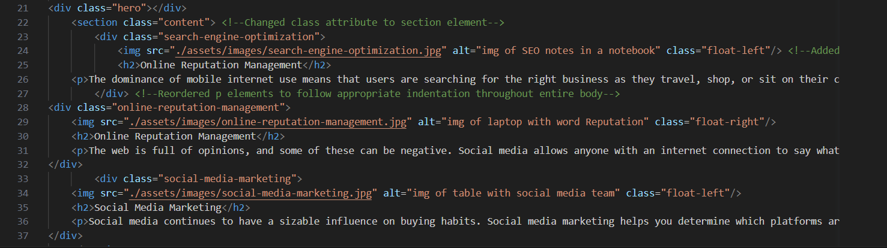
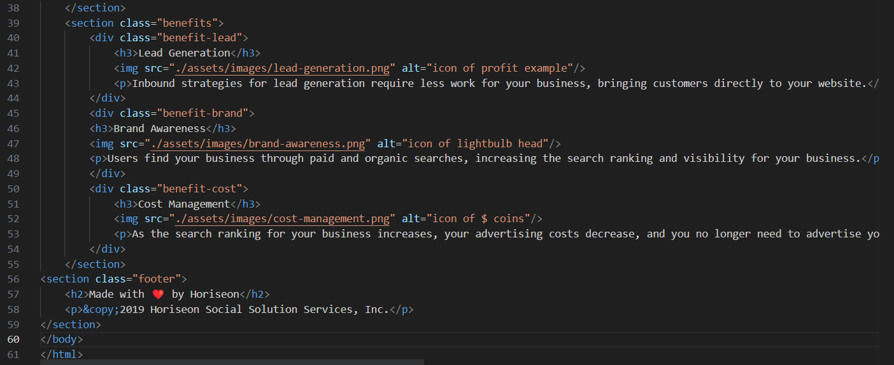

# Horiseon Social Solutions Challenge

To whom it may concern, as a student of the bootcamp I have been assigned to review a code as an "on the job ticket" challenge as my first assignment. I have made the appropriate modifications to the code I was given to improve optimization of the webpage for users & developers alike. The following will give context into the changes that have been made

## Starter Code 

The initial code that I was given appeared as following:

## New Orientation

I modified the previous code I was given to be read easier and faster. Here is what the code looks like now:

## CSS 

I did NOT add screenshots for CSS as I only reorganized the list to match the sequences in which the elements are produced in the HTML file

## Link

http://127.0.0.1:5500/HoriseonHomeworkProject.html